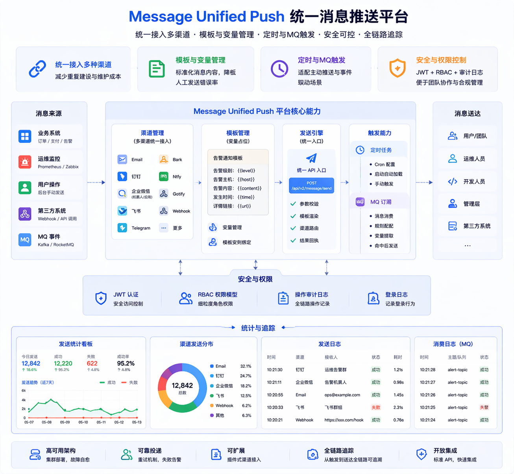
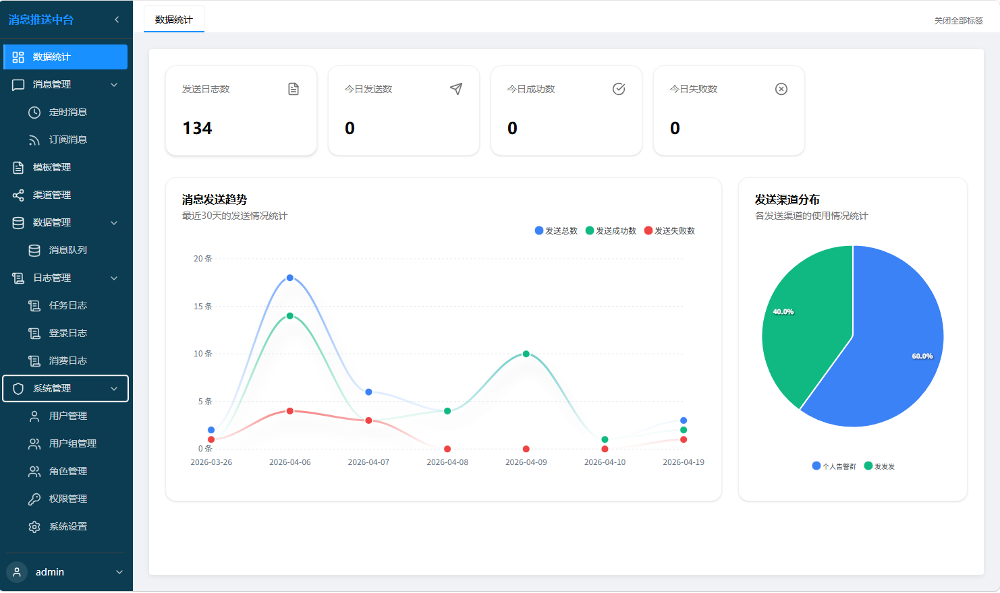
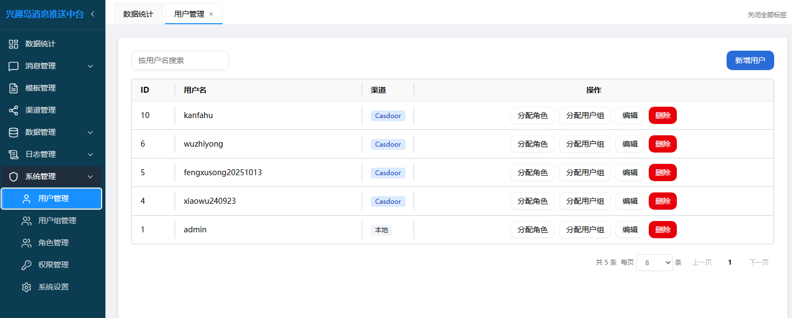
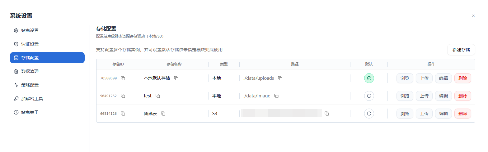
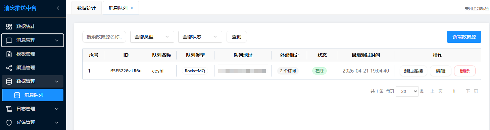
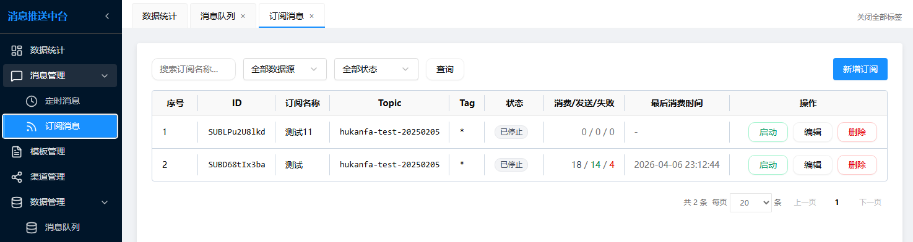
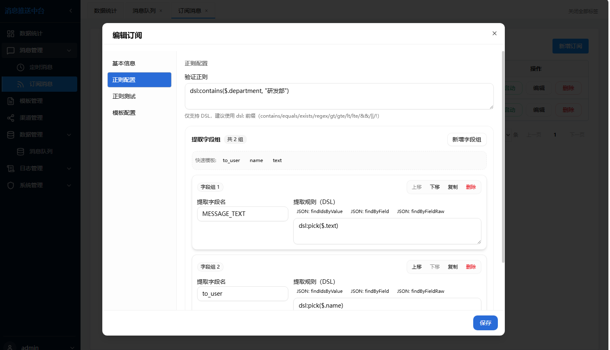
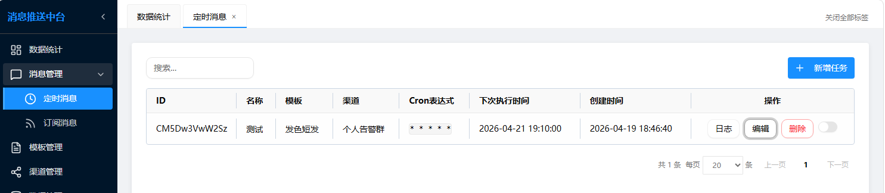
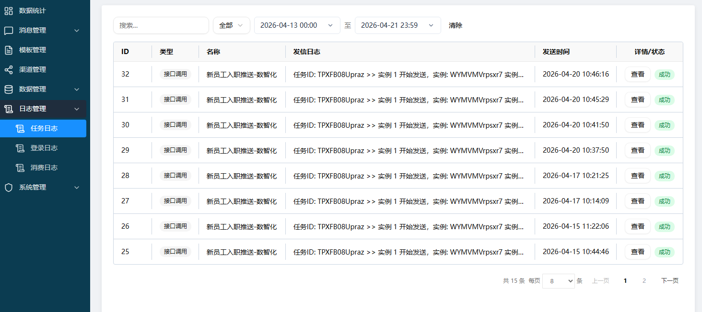
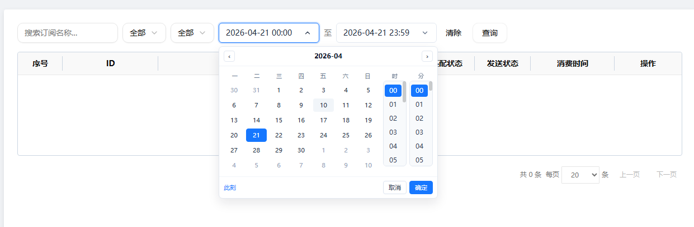

<h1 align="center"> Message Unified Push</h1>

<p align="center">
  <a href="https://go.dev/"></a>
  <a href="https://vuejs.org/"></a>
  <a href="https://gin-gonic.com/"></a>
  
  
  <a href="LICENSE"></a>
</p>

<p align="center">
  📣 一个面向运维告警、业务通知、自动化任务与多系统整合的统一消息推送平台 📣
</p>

<p align="center">
  
</p>
Message Unified Push 是一个面向运维告警与业务通知的统一消息推送平台。  
它把多渠道发送、模板管理、定时任务、MQ 订阅触发、权限控制和审计日志整合到一个系统中，提供统一 API 与可视化后台。

# 致谢

本项目基于原开源项目 [Message-Push-Nest](https://github.com/engigu/Message-Push-Nest) 改造而来。

首先感谢原项目 Message-Push-Nest 的作者与所有贡献者。原项目已经提供了非常坚实的基础，包括 多渠道能力、定时消息、消息模板能力以及整体产品方向。

本项目将延续原作者开源精神 ！！！



# 1 需求场景

- 统一接入多种消息渠道，减少重复建设与维护成本。
- 用模板和变量管理通知内容，降低人工发送错误率。
- 支持定时任务与 MQ 触发，适配主动推送和事件驱动场景。
- 具备 JWT + RBAC + 审计日志，便于团队协作和权限管理。

# 2 核心能力

- 统一渠道管理：Email、钉钉、企微机器人/应用、飞书、Telegram、Bark、Ntfy、Gotify、Webhook 等。
- 模板消息：变量占位、模板实例绑定、统一发送入口（`/api/v2/message/send`）。
- 定时消息：Cron 配置、启动自动加载、手动触发。
- MQ 订阅：消息消费、规则匹配、变量提取、命中后自动发送。
- 统计与追踪：发送日志、登录日志、消费日志、统计看板。

# 3 更新调整

`Message Unified Push` 诞生主要适应于企业内部使用需求，相较于原项目主要改动点如下

- 调整UI布局




- 增加RBAC权限管理体系，对接 Casdoor 实现企微登录



- 区分系统设置和个人设置

```shell
## 系统设置
1、新增：认证设置、存储设置、策略配置、加解密工具
2、优化：站点设置、数据清理
```



- 新增企业微信应用推送渠道
- 新增订阅消息功能(仅实现rocketmq)

```shell
1、支持通过订阅Topic,消费到消息即可推送
2、支持通过表达式过滤出目标消息、进一步提取需要的字段作为模板变量值，从而实现消息模板的动态更新
3、
```







- 定时消息支持关联消息模板，彻底移除原v1版本逻辑
  
- 统一日志管理，支持按时间维度查询
  
  

# 4 快速开始

## 4.1 本地模式

> **NO1: 准备配置**

Linux/macOS:

```bash
cp conf/app.example.ini conf/app.ini
```

Windows PowerShell:

```powershell
Copy-Item conf/app.example.ini conf/app.ini
```

配置数据库信息

```shell
# 自动建表，后续更新版本会自动更新表结构，不需要手动维护
[database]
Type = mysql
User = message_user
Password = K3mX0t2lG
Host = 192.168.26.11
Name = message
Port = 3307
TablePrefix = message_
; ssl enable, value: [false | true]
Ssl = false
```

> **NO2：启动前后端**

```bash
## 先启动后端
# 更新下载依赖
go mod tidy
# 启动
go run main.go

## 启动前端
cd web
# 若后端端口不是默认的 8081，则需调整前端配置，指定后端
vim config.js
    // 开发环境默认使用本地后端
    return 'http://127.0.0.1:8081';
# 安装依赖
npm ci
npm run dev

  VITE v7.3.0  ready in 954 ms
  ➜  Local:   http://localhost:5173/
```

> **NO3：访问测试**

- 健康检查：`http://127.0.0.1:8081/health`
- 管理后台：`http://localhost:5173/`
- 默认账号：`admin`
- 初始密码：首次迁移时自动生成并打印在启动日志中

## 4.2 容器方式

- 目前暂不提供镜像，可通过 `Dockerfile` 自行构建
- 容器方式需访问：<http://127.0.0.1:8081>  进入管理后台

# 5 文档导航

详细技术文档统一维护在 `docs/`，README 仅保留读者入口信息。

- 文档首页：[docs/index.md](docs/index.md)
- 功能导览：[docs/guide/features.md](docs/guide/features.md)
- 快速部署：[docs/deployment/overview.md](docs/deployment/overview.md)
- 配置说明：[docs/deployment/configuration.md](docs/deployment/configuration.md)
- API 文档：
  - [docs/api/v1.md](docs/api/v1.md)
  - [docs/api/v2.md](docs/api/v2.md)
  - [docs/api/examples.md](docs/api/examples.md)
- 本地开发：[docs/deployment/development.md](docs/deployment/development.md)

# 6 许可证

本项目基于 [MIT License](LICENSE) 开源。
