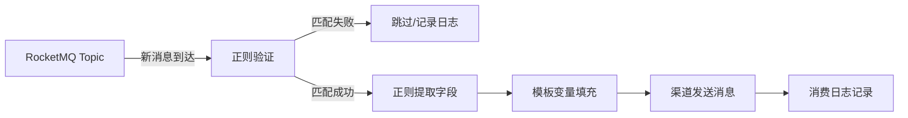

# 消息队列订阅功能 - 产品开发方案 v2.0

> 版本：v2.0  
> 日期：2026-04-05  
> 基于用户反馈重新设计

---

## 📊 需求概述

### 核心业务流程



### 用户原始需求

1. 从 RocketMQ Topic 订阅消息
2. 新消息到达时，用正则表达式验证消息内容能否提取到值
3. 如果能提取，通过正则表达式进一步提取某个字段内容
4. 将提取的字段作为模板变量填充
5. 通过模板关联的渠道发送消息

---

## 🏗️ 菜单结构调整

### 调整前（现状）

```
├── 渠道管理（一级菜单）
├── 数据源管理（一级菜单，直接展示列表）
├── 消息管理
│   ├── 定时消息
│   └── 订阅消息
└── 日志管理
    ├── 任务日志
    ├── 登录日志
    └── 消费日志
```

### 调整后（新方案）

```
├── 渠道管理（一级菜单）
├── 数据管理（一级菜单）⭐ 重命名
│   └── 消息队列（二级菜单）⭐ 新增
├── 消息管理
│   ├── 定时消息
│   └── 订阅消息
└── 日志管理
    ├── 任务日志
    ├── 登录日志
    └── 消费日志
```

---

## 💾 数据模型设计

### 1. 消息队列数据源表 (mq_sources)

> 保持现有设计，Topic 在订阅层配置

```sql
CREATE TABLE mq_sources (
    id VARCHAR(12) PRIMARY KEY,           -- 主键: MS + 10位随机
    name VARCHAR(200) NOT NULL,           -- 数据源名称
    type VARCHAR(50) NOT NULL,            -- 类型: rocketmq/kafka/rabbitmq
    enabled INT DEFAULT 1,                -- 启用状态: 0-禁用 1-启用
    
    -- RocketMQ 配置
    namesrv_addr VARCHAR(500) NOT NULL,   -- NameServer 地址
    access_key VARCHAR(200),              -- 访问密钥（可选）
    secret_key VARCHAR(200),              -- 密钥（可选）
    
    -- 连接状态
    last_test_status VARCHAR(20),         -- 测试状态: success/failed
    last_test_time TIMESTAMP,             -- 最近测试时间
    test_error TEXT,                      -- 测试错误信息
    
    -- 审计字段
    created_by VARCHAR(100),
    modified_by VARCHAR(100),
    created_on TIMESTAMP DEFAULT CURRENT_TIMESTAMP,
    modified_on TIMESTAMP DEFAULT CURRENT_TIMESTAMP ON UPDATE CURRENT_TIMESTAMP
);
```

**列表展示字段**：
| 字段 | 说明 |
|------|------|
| 序号 | 自动编号 |
| ID | 数据源唯一标识 |
| 队列名称 | name 字段 |
| 队列类型 | type 字段（RocketMQ/Kafka/RabbitMQ） |
| 队列地址 | namesrv_addr 字段 |
| 外部绑定 | 关联的订阅数量 |
| 操作列 | 测试连接/编辑/删除 |

### 2. 订阅规则表 (subscriptions)

> 保持现有设计

```sql
CREATE TABLE subscriptions (
    id VARCHAR(12) PRIMARY KEY,           -- 主键: SUB + 10位随机
    name VARCHAR(200) NOT NULL,           -- 订阅名称
    source_id VARCHAR(12) NOT NULL,       -- 关联数据源ID
    
    -- Topic 配置
    topic VARCHAR(200) NOT NULL,          -- Topic 名称
    tag VARCHAR(200),                     -- Tag 过滤（可选）
    group_name VARCHAR(200),              -- Consumer Group 名称
    
    -- 正则配置
    validate_regex TEXT,                  -- 验证正则：检查消息是否匹配
    extract_regex TEXT,                   -- 提取正则：提取字段值
    extract_field VARCHAR(100),           -- 提取字段名（作为模板变量）
    
    -- 模板配置
    template_id VARCHAR(12) NOT NULL,     -- 关联消息模板ID
    
    -- 运行状态
    enabled INT DEFAULT 1,                -- 启用状态
    status VARCHAR(20) DEFAULT 'stopped', -- 运行状态: running/stopped/error
    
    -- 统计信息
    total_consumed INT DEFAULT 0,         -- 总消费数
    total_sent INT DEFAULT 0,             -- 总发送数
    total_failed INT DEFAULT 0,           -- 总失败数
    last_consume_time TIMESTAMP,          -- 最后消费时间
    
    -- 审计字段
    created_by VARCHAR(100),
    modified_by VARCHAR(100),
    created_on TIMESTAMP DEFAULT CURRENT_TIMESTAMP,
    modified_on TIMESTAMP DEFAULT CURRENT_TIMESTAMP ON UPDATE CURRENT_TIMESTAMP,
    
    FOREIGN KEY (source_id) REFERENCES mq_sources(id),
    FOREIGN KEY (template_id) REFERENCES message_template(id)
);
```

### 3. 消费日志表 (consume_logs)

> 保持现有设计

```sql
CREATE TABLE consume_logs (
    id BIGINT AUTO_INCREMENT PRIMARY KEY,
    subscription_id VARCHAR(12) NOT NULL, -- 订阅规则ID
    msg_id VARCHAR(100),                  -- RocketMQ 消息ID
    topic VARCHAR(200),                   -- Topic
    tag VARCHAR(200),                     -- Tag
    
    -- 消息内容
    raw_message TEXT,                     -- 原始消息
    matched INT DEFAULT 0,                -- 是否匹配: 0-未匹配 1-匹配
    
    -- 提取结果
    extracted_values JSON,                -- 提取的字段值 {"field": "value"}
    
    -- 发送结果
    send_status INT DEFAULT 0,            -- 发送状态: 0-未发送 1-成功 2-失败
    send_error TEXT,                      -- 发送错误信息
    
    -- 时间
    consume_time TIMESTAMP DEFAULT CURRENT_TIMESTAMP,
    
    INDEX idx_subscription_id (subscription_id),
    INDEX idx_consume_time (consume_time)
);
```

---

## 🔧 功能详细设计

### 一、数据管理 - 消息队列

#### 1.1 列表页面

**文件路径**：`web/src/components/pages/dataManagement/MQSources.vue`

**页面元素**：
```
┌─────────────────────────────────────────────────────────────────────────┐
│ 消息队列                                                                 │
│ 管理 RocketMQ、Kafka 等消息队列数据源                                     │
├─────────────────────────────────────────────────────────────────────────┤
│ [搜索名称...] [队列类型 ▼] [连接状态 ▼] [查询] [新增队列]                 │
├─────────────────────────────────────────────────────────────────────────┤
│ 序号 │ ID    │ 队列名称 │ 队列类型 │ 队列地址        │ 外部绑定 │ 状态   │ 操作      │
│ 1    │ MS001 │ 生产环境 │ RocketMQ │ 192.168.1.1:9876│ 2个订阅  │ 正常   │ 测试/预览/编辑/删除 │
└─────────────────────────────────────────────────────────────────────────┘
```

**筛选功能**：
- 名称搜索（模糊匹配）
- 队列类型筛选（RocketMQ/Kafka/RabbitMQ）
- 连接状态筛选（成功/失败/未测试）

**操作按钮**：
| 按钮 | 功能 | 权限码 |
|------|------|--------|
| 测试连接 | 测试 NameServer 连接 | data:mq-source:test |
| 编辑 | 编辑数据源配置 | data:mq-source:edit |
| 删除 | 删除数据源（需确认，有订阅时禁止删除） | data:mq-source:delete |

#### 1.2 新增/编辑队列

**表单字段**：
| 字段 | 类型 | 必填 | 说明 |
|------|------|------|------|
| 队列名称 | 文本 | ✅ | 数据源名称，如"生产环境 RocketMQ" |
| 队列类型 | 下拉 | ✅ | RocketMQ / Kafka / RabbitMQ |
| NameServer 地址 | 文本 | ✅ | 如 192.168.1.1:9876;192.168.1.2:9876 |
| Access Key | 文本 | ❌ | ACL 访问密钥（可选） |
| Secret Key | 密码 | ❌ | ACL 密钥（可选） |
| 启用状态 | 开关 | - | 默认启用 |

**连接测试说明（已调整）**：
- 当前使用 TCP 探测（类似 telnet）验证 NameServer `ip:port` 连通性。
- 不再依赖 Topic 路由，不再提供“预览消息”能力。

### 二、消息管理 - 订阅消息

#### 2.1 列表页面

**文件路径**：`web/src/components/pages/message/Subscriptions.vue`（已存在，需调整）

**页面元素**：
```
┌─────────────────────────────────────────────────────────────────────────┐
│ 订阅消息                                                                 │
│ 配置消息队列订阅规则，自动提取字段并发送消息                               │
├─────────────────────────────────────────────────────────────────────────┤
│ [搜索名称...] [数据源 ▼] [状态 ▼] [查询] [新增订阅]                       │
├─────────────────────────────────────────────────────────────────────────┤
│ 序号│ ID   │ 名称   │ 数据源 │ Topic    │ Tag │ 模板   │ 状态   │ 统计   │ 操作        │
│ 1   │ SUB01│ 订单通知│ 生产环境│ order-topic│ *  │ 订单模板│ 运行中 │ 10/8/2│ 停止/编辑/删除│
└─────────────────────────────────────────────────────────────────────────┘
```

**统计显示**：`消费数/发送数/失败数`

#### 2.2 新增/编辑订阅

**表单字段**：

| 字段分组 | 字段 | 类型 | 必填 | 说明 |
|---------|------|------|------|------|
| 基本信息 | 订阅名称 | 文本 | ✅ | 如"订单创建通知" |
| | 数据源 | 下拉 | ✅ | 选择已配置的消息队列 |
| | Topic 名称 | 文本 | ✅ | 如 "order-topic" |
| | Tag 过滤 | 文本 | ❌ | 如 "TagA \|\| TagB"，不填订阅所有 |
| | Consumer Group | 文本 | ✅ | 如 "ops-message-unified-push-order" |
| 正则配置 | 验证正则 | 文本域 | ❌ | 用于判断消息是否匹配 |
| | 提取正则 | 文本域 | ❌ | 用于提取字段值 |
| | 提取字段名 | 文本 | ❌ | 提取的字段名，如 "order_id" |
| 模板配置 | 消息模板 | 下拉 | ✅ | 选择消息模板 |
| | 启用状态 | 开关 | - | 默认启用 |

**正则配置说明**：

```
验证正则示例：^.*"status":"created".*$
→ 只有包含 "status":"created" 的消息才会被处理

提取正则示例："orderId":"(\w+)"
→ 提取 orderId 字段值

提取字段名：order_id
→ 模板中可使用 {{order_id}} 变量
```

**正则测试功能**（建议新增）：
```
┌────────────────────────────────────────────────────────────┐
│ 正则测试                                                   │
├────────────────────────────────────────────────────────────┤
│ 消息内容:                                                  │
│ [                                                        ] │
│ {"orderId":"12345","status":"created","amount":99.9}       │
│                                                            │
│ 验证正则: ^.*"status":"created".*$                         │
│ 结果: ✅ 匹配成功                                          │
│                                                            │
│ 提取正则: "orderId":"(\w+)"                                │
│ 提取字段名: order_id                                       │
│ 结果: ✅ 提取成功 = "12345"                                │
└────────────────────────────────────────────────────────────┘
```

---

## 🔄 业务流程

### 订阅启动流程

```
1. 用户点击"启动"按钮
2. 后端获取订阅配置
3. Consumer Manager 创建 Push Consumer
4. 注册消息处理回调
5. 更新状态为 running
```

### 消息处理流程

```go
// 伪代码
func handleMessage(msg *Message) {
    // 1. 记录消费日志
    log := createConsumeLog(msg)
    
    // 2. 正则验证
    if validateRegex != "" {
        if !regexp.Match(validateRegex, msg.Body) {
            log.Matched = false
            saveLog(log)
            return // 跳过
        }
    }
    log.Matched = true
    
    // 3. 字段提取
    extractedValue := ""
    if extractRegex != "" && extractField != "" {
        matches := regexp.FindSubmatch(extractRegex, msg.Body)
        if len(matches) > 1 {
            extractedValue = matches[1]
        }
    }
    log.ExtractedValues = {extractField: extractedValue}
    
    // 4. 模板渲染
    renderedContent := template.Render({extractField: extractedValue})
    
    // 5. 消息发送
    err := sendMessage(templateID, renderedContent)
    if err != nil {
        log.SendStatus = FAILED
        log.SendError = err.Error()
    } else {
        log.SendStatus = SUCCESS
    }
    
    // 6. 保存日志并更新统计
    saveLog(log)
    updateStats(subscriptionID)
}
```

---

## 🛠️ 开发任务清单

### Phase 1: 菜单结构调整（0.5天）

- [x] 修改 `Sidebar.vue`：
  - 将"数据源管理"改为"数据管理"
  - 添加二级菜单"消息队列"
  - 调整路由路径

### Phase 2: 数据源功能增强（1天）

- [x] 后端：实现连接测试
  - 使用 TCP 探测验证 NameServer `ip:port` 连通性
  - 返回连接结果并更新状态
  
- [x] 前端：移除预览消息相关 UI
  - 操作列仅保留测试连接/编辑/删除

### Phase 3.5: 系统设置增强（0.5天）

- [x] 新增“状态更新策略”菜单
  - 路径：`系统管理 -> 系统设置 -> 状态更新策略`
  - 配置项：手动/自动开关 + 自动更新频率（秒）

### Phase 3: 订阅功能优化（1天）

- [x] 前端：添加正则测试功能
  - 输入消息内容
  - 实时显示匹配结果（已改为调用后端正则测试接口）
  
- [x] 后端：完善消息发送逻辑
  - 集成现有发送服务
  - 错误处理优化

### Phase 4: 测试与文档（0.5天）

- [ ] 集成测试（待补）
- [ ] 更新用户文档

---

## 📝 需要修改的文件

### 前端文件

| 文件 | 操作 | 说明 |
|------|------|------|
| `web/src/components/layout/Sidebar.vue` | 修改 | 菜单结构调整 |
| `web/src/components/pages/dataManagement/MQSources.vue` | 新主实现 | 数据源列表/筛选/测试/编辑/删除 |
| `web/src/components/pages/dataManagement/MQSourceForm.vue` | 新主实现 | 数据源新增/编辑/连接测试 |
| `web/src/components/pages/mqSources/MQSources.vue` | 已删除 | 旧路径兼容壳已清理 |
| `web/src/components/pages/mqSources/MQSourceForm.vue` | 已删除 | 旧路径兼容壳已清理 |
| `web/src/router/index.js` | 修改 | 路由切换到 dataManagement 路径 |
| `web/src/components/pages/subscriptions/SubscriptionForm.vue` | 增强 | 添加正则测试功能 |
| `web/src/components/pages/subscriptions/Subscriptions.vue` | 修复 | 补齐 SubscriptionForm 导入与页面稳定性 |
| `web/src/components/pages/settings/MQStatusPolicySettings.vue` | 新增 | 状态更新策略维护页 |
| `web/src/components/pages/consumeLogs/ConsumeLogs.vue` | 兼容 | 对接后端消费日志接口返回结构 |

### 后端文件

| 文件 | 操作 | 说明 |
|------|------|------|
| `service/mq_source_service/source.go` | 调整 | 连接测试改为 TCP 探测，移除消息预览逻辑 |
| `service/mq_consumer/consumer_manager.go` | 完善 | 完善消息发送逻辑 |
| `service/subscription_service/subscription.go` | 增强 | 新增 Group+Topic 唯一性校验、详情查询、正则测试服务 |
| `routers/api/v1/subscription.go` | 增强 | 新增正则测试接口控制器 |
| `routers/router.go` | 增强 | 注册 `/subscriptions/regex-test` 路由 |
| `models/mq_source.go` | 增强 | 支持未测试状态筛选（`untested`） |
| `service/consume_log_service/consume_log.go` | 完善 | 实现消费日志列表/详情/统计查询 |
| `routers/api/v1/consume_log.go` | 完善 | 兼容 `send_status`/`subscription_name` 参数 |
| `models/consume_log.go` | 增强 | 新增按 ID 获取消费日志方法 |
| `pkg/constant/constant.go` | 增强 | 新增 `mq_status_policy` 配置常量和默认值 |
| `service/settings_service/settings.go` | 增强 | 新增状态更新策略配置校验 |
| `service/settings_service/init_site.go` | 增强 | 新增状态更新策略初始化 |
| `migrate/migrate.go` | 增强 | 启动迁移时初始化状态更新策略 |

---

## ✅ 当前实现完成度（2026-04-06）

- 菜单结构调整：已完成（数据管理 -> 消息队列）
- 数据源管理：已完成（列表、筛选、连接测试、编辑删除、删除约束）
- 订阅管理：已完成（列表、启停、编辑约束、删除约束、Group+Topic 唯一性）
- 正则测试：已完成（后端 API + 前端联调，结果可视化展示）
- 消费处理链路：已完成（验证 -> 提取 -> 模板发送 -> 消费日志 -> 统计）
- 消费日志页面：已完成（接口实现与前后端参数兼容）
- 系统设置：已完成（新增“状态更新策略”配置页）
- 运行稳定性修复：已完成（多个前端运行时错误已修复）
- 待完成项：集成测试、用户文档更新

---

## ⚠️ 注意事项

1. **数据源删除约束**：如果数据源有关联的订阅，禁止删除
2. **订阅编辑约束**：运行中的订阅不能编辑，需先停止
3. **Consumer Group 唯一性**：同一 Group 不能重复订阅相同 Topic
4. **连接测试语义**：当前仅做 TCP 连通性探测，不验证 Topic 路由和消息消费能力

---

**文档维护**：本方案随开发进度持续更新  
**最后更新**：2026-04-05
